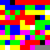

# Brainfuck Go

A [brainfuck](https://en.wikipedia.org/wiki/Brainfuck) interpreter written in go.

## Image as code

Includes bf2png/png2bf transpilers to encode/decode traditional bf code to/from png files.

This (if it wasn't zoomed in x10):



Is equivalent to this:

```bash
--[+++++++<---->>-->+>+>+<<<<]<.>++++[-<++++<++>>>->--<<]>>-.>--..>+.<<<.<<-.>>+
>->>.+++[.<]<<++.
```

Which, when interpreted, does this:

```bash
Hello World!
```

## Test

```bash
go test ./... --cover
```

## Run

```bash
go run cmd/vm/main.go -source=fixtures/text/mandelbrot.bf
go run cmd/bf2png/main.go -source=fixtures/text/mandelbrot.bf
go run cmd/png2bf/main.go -source=fixtures/image/mandelbrot.png
```

## Build & Run

```bash
go build -o bin/vm -v github.com/TheInvader360/brainfuck-go/cmd/vm && ./bin/vm -source=fixtures/text/mandelbrot.bf
go build -o bin/bf2png -v github.com/TheInvader360/brainfuck-go/cmd/bf2png && ./bin/bf2png -source=fixtures/text/mandelbrot.bf
go build -o bin/png2bf -v github.com/TheInvader360/brainfuck-go/cmd/png2bf && ./bin/png2bf -source=fixtures/image/mandelbrot.png
```
